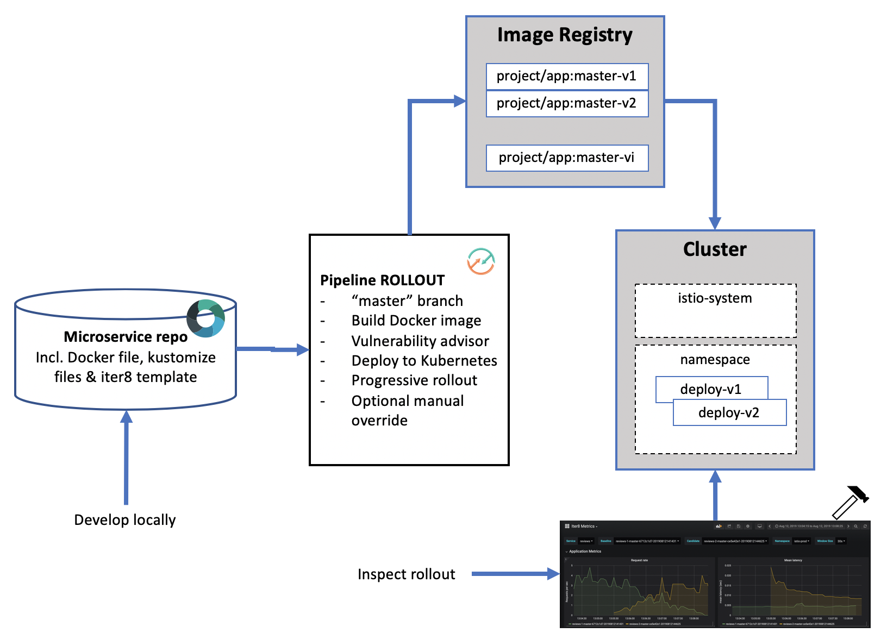

# Progressive microservice rollout in Kubernetes using **iter8**

This Devops process illustrates how to deploy a new version of an application using a progressive rollout. In particular, this process leverages iter8 to automatically re-configure Istio over time to gradually shift traffic from the current version to a candidate version. Iter8 compares metrics and error rates between the two versions, rolling back if they are not within specified tolerances.

The sample application used to illustrate progressive rollout is adapted from the reviews microservice from the Istio sample application [bookinfo](https://github.com/istio/istio/tree/master/samples/bookinfo/src). This microservice is written in Java and builds as a Docker image. The DevOps toolchain is preconfigured for continuous delivery with Vulnerability Advisor, source control, issue tracking, online editing, and deployment and progressive rollout to the IBM Cloud Kubernetes Service.

Application code is stored in source control, along with its Dockerfile, its Kubernetes deployment script (described using [kustomize](https://kustomize.io/)) and an iter8 _experiment_ template.
The target cluster is configured during toolchain setup (using an IBM Cloud API key and cluster name). You can later change these by modifying the Delivery Pipeline configuration.
Any code change to the master branch in the Git repo will automatically be built, validated and rolled out into the Kubernetes cluster.

  

## To get started, click this button:

  

DISCLAIMER: This toolchain uses [Istio](https://istio.io/). If you want to use the managed Istio service (vs manually installing the demo version), please ensure you target a standard cluster instead.

### Steps

Learn how to implement a progressive rollout of an application using iter8:

* At the beginning of the scenario, the pipeline deploys the application to the cluster.

* Once new function has been developed, create a pull request against master and merge it into the master branch (or just push it). The `rollout` pipeline will build and initiate a progressive rollout of the new version of the microservice.

* A successful rollout relies on the ability to compare the currently deployed version to the candidate version as traffic is shifted from one to the other. This assumes the service is under load. If experimenting, apply load with a load generator. A simple approach could use `watch`. See the log for the _Check app config_ job in the _CHECK PREREQS_ stage of the deploy pipeline.

* Inspect metrics for the rollout via the grafana dashboard. A direct URL can be found at the end of the log for the _Deploy to Kubernetes_ job of the _ROLLOUT_CANDIDATE_ stage. One the experiment is complete, the URL is updated in the log for the _Wait and Cleanup_ job.

* If the rollout has been configured to take more than an hour (in the iter8 experiment template file), the _ROLLOUT CANDIDATE_ stage will terminate before the rollout is complete. Once it completes, the unused version will remain deployed and unused. This needs to be manually cleaned up.

* Once the rollout has started, it can be manually short-circuited by rolling forward or backward using the _IMMEDIATE ROLLBACK_ or _IMMEDIATE ROLLFORWARD_ stages.

---

### Learn more

* Step by step [tutorial](https://www.ibm.com/cloud/garage/tutorials/canary-test-kubernetes-iter8-toolchain)
* Learn about [iter8](https://iter8.tools/)
* Learn about [Istio](https://istio.io/)
* Blog [Continuously deliver your app to Kubernetes with Bluemix](https://www.ibm.com/blogs/bluemix/2017/07/continuously-deliver-your-app-to-kubernetes-with-bluemix/)
* [Getting started with IBM Cloud clusters](https://cloud.ibm.com/docs/containers?topic=containers-getting-started)
* [Getting started with toolchains](https://cloud.ibm.com/devops/getting-started)
* [Documentation](https://cloud.ibm.com/docs/services/ContinuousDelivery?topic=ContinuousDelivery-getting-started&pos=2)
* [Istio workshop](https://github.com/IBM/istio101/tree/master/workshop)
* [Managed Istio on IBM Cloud Kubernetes](https://cloud.ibm.com/docs/containers?topic=containers-istio#istio)
