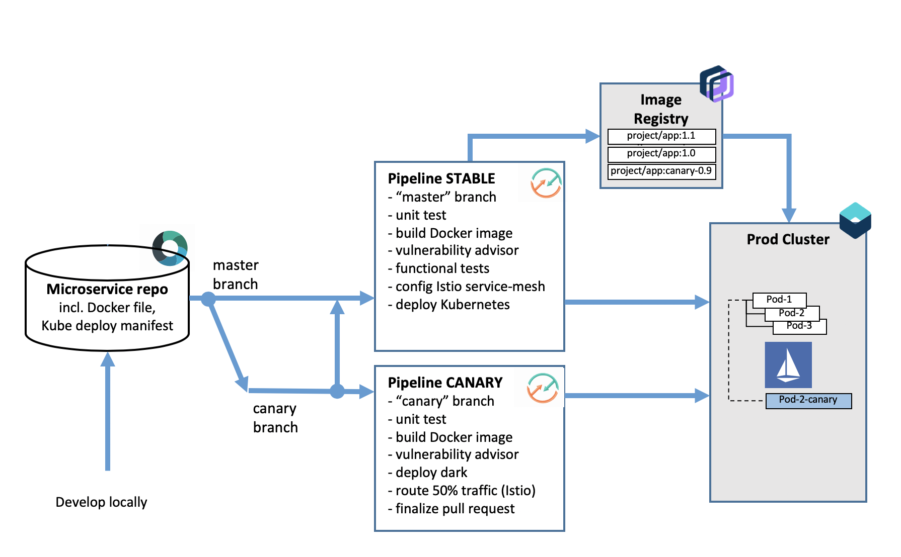

#  Canary testing in Kubernetes using Istio

### Rollout your Kubernetes application using canary testing with Istio and iter8

This Devops process illustrates how to deploy a new version of an application using a canary rollout. In particular, this process leverages iter8 to automatically re-configure Istio over time to gradually shift traffic from the current version to a candidate version. Iter8 compares metrics and error rates between the two versions, rolling back if they are not with the specified tolerances.

The sample application is using Docker and Java and is adapted from the [reviews](https://github.com/istio/istio/tree/master/samples/bookinfo/src/reviews) microservice in [bookinfo](https://github.com/istio/istio/tree/master/samples/bookinfo/src). It incliudes a DevOps toolchain that is preconfigured for canary rollout, continuous delivery with Vulnerability Advisor, source control, issue tracking, online editing, and deployment to the IBM Cloud Kubernetes Service.

Application code is stored in source control, along with its Dockerfile, its Kubernetes deployment script (described using [kustomize](https://kustomize.io/)) and an [iter8](https://github.com/iter8-tools/docs) experiment template.
The target cluster is configured during toolchain setup (using an IBM Cloud API key and cluster name). You can later change these by modifying the Delivery Pipeline configuration.
Any code change to the master branch in the Git repo will automatically be built, validated and deployed into the Kubernetes cluster.

----> **FIX THIS** <----

### To get started, click this button:

DISCLAIMER: This toolchain uses [Istio](https://istio.io/) 1.1.5+, which requires more resources than available in IKS lite clusters, please ensure you target a standard cluster instead.

### Steps

Learn how to implement canary rollout of an application using Istio and iter8:

* At the beginning of the scenario, you have master pipeline deploy to prod with application "v1".

* Once new function has been developed, create a pull request against master and merge it into the master branch. The `stable` pipeline will build and initiate a canary rollout of the new version of the service.

* A successful canary rollout relies on the ability to compare the currently deployed version to the candidate version as traffic is shifted from one to the other. This assumes the service is under load. If experimenting, apply load with a load generator or with a tool such as `watch`, for example:

    watch -x -n 0.1 curl -Is service_url

* Inspect metrics for the canary via the canary dashboard. A direct URL can be found at the end of the log for the _Deploy to Kubernetes_ step of the _ROLLOUT_CANDIDATE_ stage.

* If the canary rollout has been configured to take more than an hour (in the iter8 experiment template file), the _ROLLOUT CANDIDATE_ stage will terminate before the rollout is complete. Once it completes, the unused version will remain deployed and unused -- Istio will be configured to send traffic to only one deployment. This needs to be manually cleaned up.

* Once the rollout has started, it can be manually short-circuited by rolling forward or backward using the _IMMEDIATE ROLLBACK_ or _IMMEDIATE ROLLFORWARD_ stages. This can most reliably be done using the `Send To` tool on the _PREPARE CANDIDATE ROLLOUT_ stage.s

---
### Learn more 

* Learn about [iter8](https://github.com/iter8-tools/docs)
* Learn about [Istio](https://istio.io/)
* ----> Blog [Continuously deliver your app to Kubernetes with Bluemix](https://www.ibm.com/blogs/bluemix/2017/07/continuously-deliver-your-app-to-kubernetes-with-bluemix/) <----
* ----> Step by step [tutorial](https://www.ibm.com/cloud/garage/tutorials/use-canary-testing-in-kubernetes-using-istio-toolchain) <-----
* [Getting started with IBM Cloud clusters](https://cloud.ibm.com/docs/containers?topic=containers-getting-started)
* [Getting started with toolchains](https://cloud.ibm.com/devops/getting-started)
* [Documentation](https://cloud.ibm.com/docs/services/ContinuousDelivery?topic=ContinuousDelivery-getting-started&pos=2)
* [Istio workshop](https://github.com/IBM/istio101/tree/master/workshop)
* [Managed Istio on IBM Cloud Kubernetes](https://cloud.ibm.com/docs/containers?topic=containers-istio#istio)
