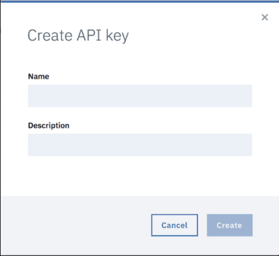
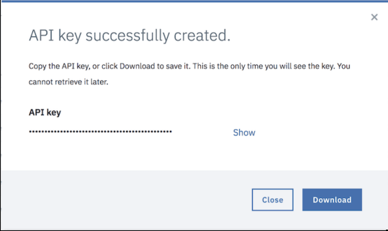
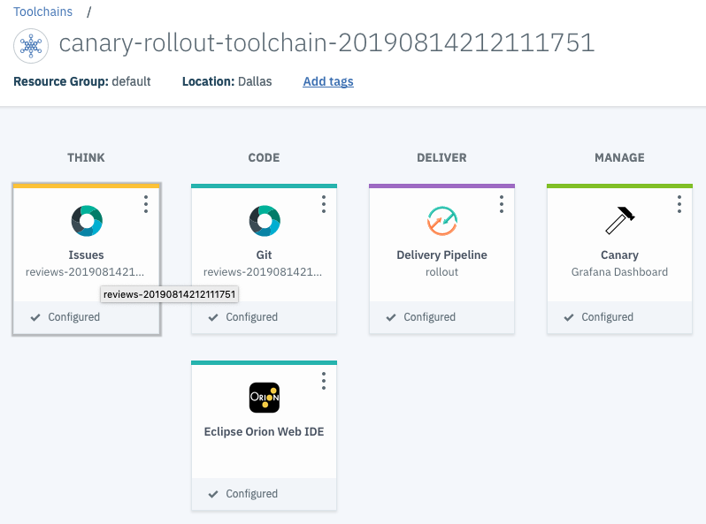
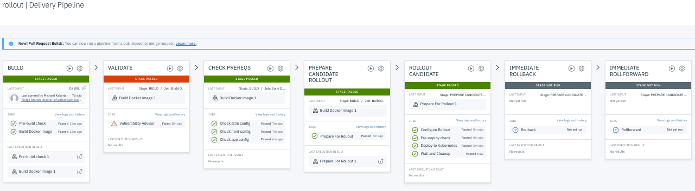
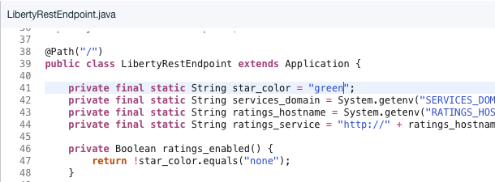
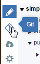

# Run your first canary test in Kubernetes using the iter8 toolchain

Set up, use, and maintain a productive DevOps toochain by using the iter8 toolchain template.

This tutorial show you how a team can set up, use and maintain a productive DevOps toolchain by using the toolchain template "Canary testing in Kubernetes using **iter8**". A canary release is a technique to reduce the risk of introducing a new software verson in production. You can slowly rollout the change to a small subset of users before rolling it out to the enitire infrastructure and making it available to everyone.

In this scenario, a canary rollout is initiated when new features are merged into the master branch. The new features are built into a Docker image which is deployed using kustomize to modify deployment files so that the new version, the candidate version, can be deployed side-by-side with the current, or baseline, version. The toolchain configures Istio via iter8 to gradually increase traffic to the candidate version while simulataneously assessing the candidate version.

This tutorial uses the following components:

- The sample application is one of the 
- The toolchain uses Kubernetes provided by IBM Cloud Kubernetes Service, with IBM Cloud Continuous Delivery to build, testm and deploy the application.

This diagram shows how the tools work together.

By default, the toolchain comes with these tool integrations:

- A [Git Repos and Issue Tracking](https://cloud.ibm.com/docs/services/ContinuousDelivery/git_working.html) repository (repo) that is hosted by IBM to store the source code, Dockerfile, and Kubernetes deployment scripts. Included is a Git issue tracking repo.
- A [delivery pipeline](https://www.ibm.com/cloud/garage/practices/deliver/tool_delivery_pipeline) for the rollout  pipeline, The pipeline automatically creates a new version of the application using the code in master branch, and adapts its deployment files so that the deployment occurs in parallel with an existing deployment. Iter8 is used to control the flow of traffic to the two version (using Istio ) and to assess the new version, rolling back if it is not satisfactory.
- The [Eclipse Orion Web IDE](https://www.ibm.com/cloud/garage/practices/code/tool_eclipse_orion_web_ide/), which you can use to edit your code and deploy it with the pipeline from a web browser.
- A Grafana dashboard that can be opened to visualize the behavior of the two versions being compared.

## Tutorial

In this tutorial, you configure the toolchain, deploy the application, and then complete the following tasks:

- Explore the delivery pipeline.
- Modify the application and commit to master to automatically build and rollout using canary testing.

## Prerequisites

(1)
You must have an IBM Cloud account. The account is free and provides access to everything you need to develop, track, plan, and deploy applications. [Sign up for an account](https://cloud.ibm.com/registration/). The account requires an IBMid. If you don't have an IBMid, you can create one when you register. Everything you need to run this tutorial can be done with the free account.

(2)
Verify that the [required toolchains and tool integrations are available](https://cloud.ibm.com/docs/services/ContinuousDelivery/cd_about.html) in your region and IBM Cloud environment. A toolchain is a set of tool integrations that support development, deployment, and operations tasks.

(3)
If you don't have a Kubernetes cluster, create one using either the UI or the CLI:

a. Go to the [Kubernetes Cluster catalog entry](https://cloud.ibm.com/containers-kubernetes/catalog/cluster).

b. Click **Kubernetes Cluster**.

c. On the Create a Kubernetes Cluster page, for the cluster type, select **standard** and type the cluster name. For more information, see the [IBM Cloud Docs](https://cloud.ibm.com/docs/containers/cs_clusters.html). For this tutorial, a standard cluster with at least 3 worker nodes that each have 4 cores and 16 GB memory (b3c.4x16) or more is required in order to run Istio. For more information, see [Creating a standard cluster in the console](https://cloud.ibm.com/docs/containers?topic=containers-clusters#clusters_ui).

Additionally, the cluster and worker nodes must run at least the minimum supported version of Kubernetes, which you can review by running this command:

    ibmcloud ks addon-versions --addon istio.

d. Note: The process to create the cluster can take a few minutes. As the cluster is created, it progresses through these stages: Deploying, Pending, and Ready. You might be asked to download the command-line interface (CLI) for IBM Cloud and IBM Cloud Kubernetes Service. You do not need the CLI for those tools to complete this tutorial. If you want to install the CLI, follow the directions that are displayed.

(4)
Enable the [Manged Istio](https://cloud.ibm.com/docs/containers?topic=containers-istio#istio) add-on in the Kubernetes Cluster.

a. On the Cluster overview page, go to the **Add-ons** tab
b. Click **Install** on the Istio Managed add-on

c. Select **Istio** and optional **Extras** then **Install**. You don't need the sample as this toolchain is going to create one. For more information on the managed Istio add-on, see the [documentation](https://cloud.ibm.com/docs/containers?topic=containers-istio#istio).

**Note:** You need an API Key for this tutorial. You can create an API Key when you configure your toolchain integrations in task 2. However, the following instructions show you how to create an API Key to use in this tutorial by using the UI or the CLI.

(5)
Create an API Key.

a. To create an IBM Cloud API Key, go to User management, click your user name, scroll to the API keys section, and click the Create an IBM Cloud API key button.
b. Type a name and description for your new API Key and click Create.

The new API Key is shown.

c. Save the API Key string by either copying the key or downloading the key file. You can't retrieve it later.

**Important:** You must enter this exact API string during the toolchain creation process.

To create the cluster and the API Key by using the CLI, follow these steps:

a. Install the [IBM Cloud CLI](https://cloud.ibm.com/docs/cli/index.html).

b. Install the IBM Cloud Kubernetes Service plug-in.

    ibmcloud plugin install container-service

c. Install the Container Registry plug-in.

    ibmcloud plugin install container-registry

d. Create the cluster.

    ibmcloud cs cluster-create --name <cluster name>

e. Create the API Key.

    ibmcloud iam api-key-create <my api key>

f. Save the API Key string.

**Important:** You must type this exact string during the toolchain creation process.

For more information about the IBM Cloud Container Registry service, see the [IBM Cloud Docs](https://cloud.ibm.com/docs/services/Registry/index.html#index).

(6)
To visualize the progress of a canary rollout, you must expose the grafana installed with Istio. By default this service is only accessible from within the cluster.

a. To expose the service, execute this command:

    kubectl --namespace istio-system expose service grafana --name=grafana-exposed --type=NodePort --target-port=3000

b. You will need the URL of the grafana service to configure the toolchain, you can get it as:

    HOST=$(kubectl --namespace istio-system get service istio-ingressgateway --output jsonpath='{.status.loadBalancer.ingress[0].ip}')
    PORT=$(kubectl --namespace istio-system get service grafana-exposed --output jsonpath='{.spec.ports[0].nodePort}')
    GRAFANA_URL="http://$HOST:$PORT"
    echo $GRAFANA_URL

## Task 1: Create the toolchain

Start the process of creating the "Canary rollout in Kubernetes using iter8" toolchain.

(1) Open the creation page for the toolchain by clicking the **Create toolchain** button:

(2) Review the toolchain diagram. This diagram shows each tool integration in its lifecycle phase in the toolchain.

<-- TBD picture --> 

(3) Review the default information for the toolchain settings:

- The toolchain's name identifies it in IBM Cloud. If you want to use a different name, change the toolchain's name.
- The region to create the toolchain in. If you want to use a different region, select it from the list of available regions.
- The resource group or organization to create the toolchain in. Click the link to switch between selecting resource groups and organizations. If you want to use a different resource group or org, select it from the list of available resource groups or organizations.

## Task 2: Configure tool integrations

Finish the process of creating the toolchain by configuring the tool integrations. To try the full scenario in this tutorial, configure these tool integrations for your toolchain. For this task, you need your API Key and Kubernetes cluster name.

## Configure the delivery pipeline

With a delivery pipeline, you can automate the continuous building, testing, and deployment of your apps.

For more information about the delivery pipeline, see the [Pipeline overview](https://cloud.ibm.com/docs/services/ContinuousDelivery?topic=ContinuousDelivery-deliverypipeline_about#deliverypipeline_about&cm_mmc=IBMBluemixGarageMethod-_-MethodSite-_-10-19-15::12-31-18-_-pipeline-about-docs) in the IBM Cloud Docs.

To learn about the practice of creating and using delivery pipelines, see [Automate continuous delivery through a delivery pipeline](https://www.ibm.com/cloud/garage/practices/deliver/practice_delivery_pipeline/).

(1)
Click **Delivery Pipeline**.

(2)
In the **App name** field, type the name for the application. The application name must be unique. If you prefer, you can use the default value.

(3)
In the **IBM Cloud API Key** field, use the IBM Cloud API Key that you created in the prerequisite steps, or create a new one by clicking the **Create** button next to the field. To see your key, click and hold the **eye** icon. The region, cluster, and container registry namespace lists are populated only if the API Key is valid.

(4)
From the **Container registry region** list, select the region that you want the container images to be created in. This region can differ from the cluster region. The toolchain automatically configures authorizations across regions so that you can complete global deployments from a single container registry location. The default setting is to use the same registry region and cluster region.

(5)
In the **Container Registry Namespace** field, either type a namespace or select one.  If you don't have a namespace yet, the name you choose will be used to create one for you. This namespace is your folder in the global image registry in a region, which is used to manage your set of images. The namespace must be unique. It must be 4 - 30 characters and use only lowercase letters, numbers, or underscores.

**Note:** To ensure that the namespace is unique, you can create a namespace with the CLI by using the following command:

    ibmcloud cr namespace-add <my_namespace>

To verify that your namespace is created, run the `ibmcloud cr namespace-list` command.

(6)
From the cluster **Region** list, select the region for the target cluster. This region is the region of the Kubernetes cluster that you created in the prerequisite steps. This cluster can be in a different location from the image registry and in a different region from your toolchain.

(7)
In the **Cluster name** field, select the name of the Kubernetes cluster that you created in the prerequisite steps. The cluster must exist, but the registry namespace and cluster namespace are both configured by the toolchain automatically.

(8)
In the **Cluster namespace** field, use an explicit namespace in the cluster as a best practice to separate deployed resources. For instance, prod denotes a production environment in this cluster. A cluster namespace must contain at least four characters. Use distinct namespaces to insulate deployments within the same Kubernetes cluster. You can leave these settings at their default values. If the namespace does not exist yet, the pipeline automatically creates it.

In the previous steps, you provided only the names for these resources. The toolchain automatically creates the matching resources for you. If the resources exist, they are reused.

**Important:** Be sure to enter the proper API key, cluster name, and valid registry namespace so that you don't collide with another user's work. Failure to do so can result in failure in pipeline setup. If your pipeline setup fails, delete the toolchain and try again.

## Configure the canary dashboard

(1)
Click **Canary**

(2)
In the **Tool instance URL** enter the URL of the grafana dashboard. You determined this in the previous task.

## Finish creating the toolchain

Click **Create**. Several steps run automatically to set up your toolchain:

- The toolchain is created in your current Resource Group.
- The Git repo is cloned into your Git account
- The rollout pipeline is triggered. The application is built, containerized, and deployed into production. The toolchain supports parallel continuous delivery and a rich set of tools.

<-- TBD: picture -->

## Task 3: Explore the delivery pipeline

In this task, you explore the canary delivery pipeline, which deploys a new version of the application to the production environment to allow for A/B testing. The pipeline takes advantage of Istio capabilities for routing traffic, and allows you to deploy the new version in a number of different example scenarios.

When you created the toolchain, the master delivery pipeline in your toolchain ran automatically. It runs when a change to the master branch is committed into the Git repo.

Click the **Delivery Pipeline** tile for the rollout pipeline.

You should see a visualization of the whole pipeline:

(1)
Review the BUILD stage. The BUILD stage only runs when a change is committed to the master branch in the Git repo. On the stage, click the **Configure Stage** icon to explore the stage.

(2)
Click **CANCEL** to return to the pipeline.

(3)
On the VALIDATE stage, click the **Configure Stage** icon to explore the stage.

- The Vulnerability Advisor job prevents you from deploying unsafe container images. The job uses IBM Cloud Vulnerability Advisor by running the ibmcloud cr va ${PIPELINE_IMAGE_URL} container registry command. Notice how the VALIDATE stage is configured to receive the build.properties file from the build result, which automatically re-creates the respective environment properties.

- When security issues are discovered, a report is printed in the job log.

- The **Use the container image from the stage input** check box is selected.

- The VALIDATE stage is configured to be advisory so that if it fails, it does not block the pipeline. You can change this behavior by selecting the **Stop running this stage if this job fails** check box.

(4)
Click **CANCEL** to return to the pipeline.

(5)
On the CHECK PREREQS stage, click the **Configure Stage** icon to explore the stage.

- The "Check Istio config" job ensures that Istio is present in the cluster. Istio is used to manage traffic between versions of the application.

- The "Check iter8 config" job ensures that iter8 is present in the cluster. If not, it is installed. iter8 manages the rollout of new versions by configuring Istio to gradually shift traffic from on version to another. At the same time, it evaluates the behavior of the new version contining to roll forward if it is satisfactory and rolling back otherwise.

- The "Check app config" job ensures that the bookinfo applicatiuon is installed on the cluster. [Bookinfo](https://istio.io/docs/examples/bookinfo/) is a sample app used to demonstrate features of Istio. It is composed of four microservies. The `reviews` microservice that is the focus of this tutorial is one of these.

(6)
Click **CANCEL** to return to the pipeline.

(5)
On the PREPARE CANDIDATE ROLLOUT stage, click the **Configure Stage** icon to explore the stage.

- The "Prepare for Rollout" job identifies a unique name for the rollout. An iter8 experiment resource will be created with this name to manage the rollout. It can be used by the manual stages IMMEDIATE ROLLBACK and IMMEDIATE ROLLFORWARD to terminate a rollout. For details see below.

(6)
Click **CANCEL** to return to the pipeline.

(7)
On the ROLLOUT CANDIDATE stage, click the **Configure Stage** icon to explore the stage. 

- The "Configure Rollout" job creates an iter8 experiment resource in the namespace from a templated defined in the file EXPERIMENT_TEMPLATE_FILE. This defines how the rollout will proceed and what metrics should be considered to determine if the rollout is successful.

- The "Pre-deploy check: job checks that the IBM Container Service cluster is ready, and has a namespace configured with access to the private image registry (by using an IBM Cloud API Key).

- The "Deploy to Kubernetes" job uses `kustomize` to create a deployment configuration, checks to see if the Istio gateway is active, and then deploys the new version of the application into the cluster. Successful deployment of the new version triggers iter8 to begin its rollout.

- The "Wait and Cleanup" job waits until the canary rollout is complete and deletes the original version of the application.

**Note:** If the rollout is not successful, iter8 will rollback to the original version by redirecting all of the traffic to the original version. In this case, the candidate version will be deleted instead of the origina version.

**Note:** If the rollout takes more than an hour, the stage will terminate before deleting one of the versions. In this case, it will be necessary to manually delete the unused version of the application.

(8)
Click **CANCEL** to return to the pipeline.

(9)
On the IMMEDIATE ROLLBACK stage, click the **Configure Stage** icon to explore the stage. This stage is only executed if triggered manually.

- The "Rollback" job patches the iter8 experiment causing it to immediately rollback and terminate. The candidate version is then deleted.

(10)
Click **CANCEL** to return to the pipeline.

(11)
On the IMMEDIATE ROLLFORWARD stage, click the **Configure Stage** icon to explore the stage. This stage is only executed if triggered manually.

- The "Rollforward" job patches the iter8 experiment causing it to immediately rollforward and terminate. The original version is then deleted.

(12)
Click **CANCEL** to return to the pipeline.

## Task 4: Exercise the delivery pipeline

In this task, you will edit the code for the application and commit the change to the master branch. Upon commit, the delivery pipleine will build and canary rollout a new version of the application

(1)
Start load against the application. To do so using `watch` and `curl`, click on the "Check app config" of the CHECK PREREQS stage. This will open the logs for the job. At the end of the log is a command that can be used. It should looks something like:

    watch -x -n 0.1 curl -H 'Host: bookinfo.sample.dev' -Is [app_url]

(2)
Return your toolchain by selecting the toolchain in the path navigation at the top of the page.

(3)
Click the **Web IDE** tile to access the code for the application.

(4)
In the reviews code, navigate to the `reviews-application/src/main/java/application/rest` folder. Click on `LibertyRestEndpoint.java` to show the code in the IDE. You are going to edit the java code in the reviews application so that you can see the different versions of the application running in parallel in your cluster.

(5)
Change line 41 of the code to read *star_color = "green"*.

(6)
Click **File > Save**, and on the left, click the *Git* icon.

(7)
In the Git tool, make sure that you are committing your changes to the master branch by selecting origin/master in the **Reference** dropdown.

(8)
In the Working Directory Changes section, type a commit message and make sure that the changed file is selected. You can expand `LibertyRestEndpoint.java` to see the changes. The changes are highlighted. The original content is in red and the changed content is in green. After you type your message, click **Commit**.

(9)
On the Git page, click **Push** to merge your changes with the master branch. The application is automatically rebuilt and deployed by using the delivery pipeline.

(10)
Return to the toolchain's Overview page by clicking the back arrow in the Git client. You can perform the same steps as in the Web IDE by using the native Git client. Access the Git client by selecting the Git tile in the toolchain.

(11)
Click the **Delivery Pipeline** tile and follow along on the pipeline pages as the application is build and canary rolled out. Each stage (except the last two) is executed automatically.

You can follow the progress of the rollout by watching the experiment object:

    watch kubectl --namespace [my-namespace] get experiments

After the PREPARE CANDIDATE ROLLOUT stage runs, you should see a new experiment created. After the Deploy to Kubernetes job of the ROLLOUT CANDIDATE stage runs, you will see the rollout begin and the percentage of traffic will gradually shift from the original, or baseline, version to the new, or candidate, version.

Refresh the screen of the running application several times, You should see the color of the stars change as the different versions respond to the requests.

(12)
Return to the toolchain view.

## Task 5: Inspect the metrics

While the canary rollout of the new version is taking place, you can inspect its progress via the canary dashboard. The rollout process identifies a URL for a rollout specific dashboard.

(1)
Click on the **Deploy to Kubernetes** job on the **ROLLOUT CANDIDATE** stage. This opens the Stage History focused on the logs for this job.

(2)
Scroll to the bottom of the logs (or use the **Scroll to the end of the log** tool). Click on the URL labeled Canary Board. This is one of the last lines in the log.

The dashboard that opens will show a comparison of some metrics for the two versions of the application being compared.

**Note:** The dashboard URL in the log captures data from the start of the rollout to the present time. If the rollout is completed, this may include a significant portion of irrelevant data. You can limit the scope of the data to the timeframe of the rollout by using the URL at the bottom of the log for the **Wait and Cleanup** job.

## Task 6: Clean up resources

You can remove any of the content that you generated in this tutorial. To complete these steps, you must use the IBM Cloud CLI and the IBM Container Service CLI. The instructions to install the CLI are in the Prerequisites section.

To remove the content that you generated in this tutorial, follow these steps:

(1)
Delete the toolchain and specify which of the associated tool integrations you want to delete. When you delete a toolchain, the deletion cannot be undone.

a. On the DevOps dashboard, on the Toolchains page, click the toolchain to delete. Alternatively, on the application's Overview page, on the Continuous delivery tile, click **View Toolchain**.
b. Next to **View app**, click the **More Actions** menu.
c. Click **Delete**. Deleting a toolchain removes all of its tool integrations, which can delete resources that are managed by those integrations.
d. Confirm the deletion by typing the name of the toolchain and clicking **Delete**.

**Tip:** When you delete a GitHub, GitHub Enterprise, or Git Repos and Issue Tracking tool integration, the associated repo is not deleted from GitHub, GitHub Enterprise, or Git Repos and Issue Tracking. You must manually remove the repo.

(2)
Delete the cluster or discard the namespace or namespaces from it. By using the IBM Container Service CLI from a command-line window, enter this command:

    kubectl delete namespace [my-namespace]

(3)
Delete your IBM Cloud API key:

a. From the **Manage** menu, click **Security > Platform API Keys**.
b. Find your API Key in the list. From the menu near the API Key name, click **Delete**.

(4)
Delete the container images:

**Tip:** You can repeat this tutorial multiple times by using the same registry namespace and cluster parameters without discarding previously generated resources. To avoid conflicts, the names of generated resources are randomized.

To delete the images in your container image registry, enter the following command in a command-line window:

    ibmcloud cr image-rm IMAGE [IMAGE...]

If you created a registry namespace for this tutorial and you want to delete the namespace, enter this command in a command-line window:

    ibmcloud cr namespace-rm NAMESPACE

## What's next

In this tutorial, you learned how to take advantage of the IBM Cloud Continuous Delivery service to deploy an application to the IBM Cloud using a Kubernetes cluster. In addition, you deployed a second version of the application as a canary release to slowly roll out the change. For additional tutorials that focus on building cloud-native applications and Kubernetes, see the following:

    Try the [Develop and test microservices on Cloud Foundry](https://www.ibm.com/cloud/garage/tutorials/use-develop-test-microservices-on-cloud-foundry-toolchain) toolchain.

    Try the [Kubernetes app with Helm](https://www.ibm.com/cloud/garage/toolchains/develop-kubernetes-app-with-helm-toolchain/0_1) toolchain.

To learn more about microservices, see these resources:

    [Getting started with a microservices architecture](https://www.ibm.com/cloud/garage/practices/code/microservices-practice/)

    [Refactoring application code to microservices](https://www.ibm.com/cloud/garage/practices/code/refactor-to-microservices/)

    [Refactoring to microservices: Moving your data](https://www.ibm.com/cloud/garage/practices/code/refactor-to-microservices-move-data)

    [Microservices architecture](https://www.ibm.com/cloud/garage/architectures/microservices)
